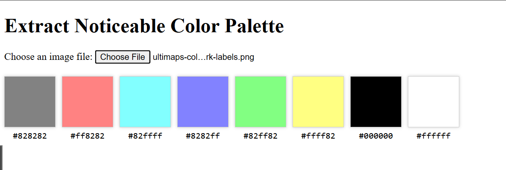

当然可以！以下是一个适合放在 GitHub 上的 `README.md`，适用于你的「可视化图像主色提取器」项目：

---

# 🎨 Noticeable Color Palette Extractor

This is a simple web tool that allows you to **extract the most noticeable (dominant) colors from an image**. Just upload an image, and the tool will display a color palette of the most prominent colors in hex format.

> ✅ Built with [color.js](https://colorjs.io/), HTML5, and vanilla JavaScript.
> 📋 Click on any color to **copy its HEX code** to the clipboard.

## 🖼 Demo

 <!-- Replace with actual screenshot path or link if available -->

## 🔧 Features

* 📷 Upload any image file (JPG, PNG, etc.)
* 🎯 Automatically extract the top 8 most noticeable colors
* 🎨 Display colors with swatches and HEX codes
* 📋 Click to copy color code to clipboard
* ⚡ Fast and client-side — no server required

## 🚀 Getting Started

### 1. Clone the repository

```bash
git clone https://github.com/yourusername/color-palette-extractor.git
cd color-palette-extractor
```

### 2. Open in your browser

Just open the `index.html` file in your favorite browser:

```bash
open index.html  # macOS
# or
start index.html  # Windows
# or
xdg-open index.html  # Linux
```

> ✅ No need for a server or build process — it's pure HTML/CSS/JS.

## 📦 Dependencies

* [color.js](https://github.com/LeaVerou/color.js) – used for analyzing and extracting prominent colors

It’s loaded via CDN:

```html
<script src="https://unpkg.com/color.js@1.2.0/dist/color.js"></script>
```

## 📁 File Structure

```
├── index.html         # Main HTML file
├── demo.png           # (Optional) Example screenshot
└── README.md          # This file
```

## 📸 Screenshot

 <!-- Optional: replace with an actual screenshot -->

## ✨ Customization

You can tweak the following parameters in the script:

```js
amount: 8        // Number of colors to extract
format: 'hex'    // Output format: hex / rgb / hsl
group: 130       // Grouping threshold for similar colors
sample: 100      // Sampling resolution (higher = slower but more precise)
```

## 📝 License

This project is open source and available under the [MIT License](LICENSE).

---

